# Lab 10 — Code Obfuscation

**Topic:** Software protection using obfuscation algorithms.
**Goal:** Implement two obfuscation techniques — *XOR string encoding* and *dead-code + control-flow obfuscation* — in both Python and C++, plus an advanced C++ example using macros, templates, and inline assembly.

---

## 1. Techniques implemented

### 1.1 XOR string encoding (data obfuscation)
Each character of a string is XOR-ed with a key. The result is a numeric array — the original text is no longer visible in the binary or source. The same key reverses the operation.

```
"Hello" + key → [104^k, 101^k, 108^k, 108^k, 111^k]
```

**Use cases:** hiding API keys, embedded passwords, license strings.

### 1.2 Dead code + control-flow obfuscation
Simple arithmetic (`a + b`, `a * b`) is hidden behind:
- a useless `for` loop that computes `i * 999` and discards it (dead code), and
- a `while (true)` loop driven by a `state` variable that switches between "compute" and "break" (control-flow flattening / state machine).

**Use cases:** hiding payment-system algorithms, anti-cracking protection.

### 1.3 Advanced C++ obfuscation
Three further techniques in `AdvancedObfuscation.cpp`:
- **Macro substitution** — `a + b` is rewritten as `(a ^ b) + 2*(a & b)` (bitwise identity for addition).
- **Template metaprogramming** — `Add<5, 3>::value` is computed at compile time, so the addition disappears from the binary.
- **Inline x86 assembly** — addition done via `addl %%ebx, %%eax`, bypassing the C++ operator entirely.

---

## 2. Repository layout

```
Lab10/
├── README.md                    ← this file
│
├── obfuscation.py               ← single-file Python demo (both techniques)
├── main.py                      ← Python entry point (modular version)
├── xor_obfuscation.py           ← Python XOR encode/decode
├── control_flow.py              ← Python hidden_multiply (state machine)
│
├── xor.cpp                      ← standalone C++ XOR demo
├── controlflow.cpp              ← standalone C++ dead-code + state-machine demo
├── AdvancedObfuscation.cpp      ← macro / template / inline-asm demo
│
├── project_cpp/                 ← multi-file C++ project (XOR + control flow)
│   ├── main.cpp
│   ├── xor_obfuscation.h / .cpp
│   └── control_flow.h / .cpp
│
├── build/                       ← compiled binaries (xor.exe, controlflow.exe,
│                                   advanced.exe, project.exe, xor_re.exe, program_re.exe)
└── screenshots/                 ← run output + Ghidra reverse-engineering captures
```

---

## 3. Build and run

### Python
```bash
python main.py
python obfuscation.py
```

### C++ standalone files
```bash
g++ xor.cpp              -o build/xor.exe
g++ controlflow.cpp      -o build/controlflow.exe
g++ AdvancedObfuscation.cpp -o build/advanced.exe
```

### C++ multi-file project
**Linux / macOS:**
```bash
g++ project_cpp/main.cpp project_cpp/xor_obfuscation.cpp project_cpp/control_flow.cpp -o program
./program
```

**Windows (MinGW):**
```bash
g++ project_cpp/main.cpp project_cpp/xor_obfuscation.cpp project_cpp/control_flow.cpp -o program.exe
program.exe
```

---

## 4. Sample output

**`main.py` / `project_cpp` (key = 12, text = "Secret"):**
```
Encoded: [95, 105, 111, 126, 105, 120]
Decoded: Secret
Multiply: 12
```

**`obfuscation.py` / `xor.cpp` (key = 23, text = "Hello World"):**
```
Encoded: [95, 114, 123, 123, 120, 55, 64, 120, 101, 123, 115]
Decoded: Hello World
```
(`obfuscated_sum(5, 7) = 12`)

**`AdvancedObfuscation.cpp`:**
```
Macro ADD(5,3)      = 8
Template Add<5,3>   = 8
Inline-asm add(5,3) = 8
```

The Python and C++ implementations produce **identical encoded byte sequences** for the same key — confirming the implementations are equivalent.

### 4.1 Disassembly comparison of the three advanced techniques

Disassembling `build/advanced.exe` with `objdump -d` exposes how each technique survives compilation. The full dump is in `build/advanced.disasm.txt`; the relevant slice of `main` is:

```asm
; --- 1. Macro ADD(5,3) = (a ^ b) + 2*(a & b) ---
mov    -0x4(%rbp),%eax        ; load a
xor    -0x8(%rbp),%eax        ; a ^ b
mov    %eax,%edx
mov    -0x4(%rbp),%eax        ; load a again
and    -0x8(%rbp),%eax        ; a & b
add    %eax,%eax              ; *2
add    %edx,%eax              ; + (a^b)
mov    %eax,-0xc(%rbp)        ; store result

; --- 2. Template Add<5,3>::value ---
movl   $0x8,-0x10(%rbp)       ; literally just "store 8"  ← computed at compile time

; --- 3. Inline-asm add(5,3) ---
mov    $0x3,%edx
mov    $0x5,%ecx
call   _Z3addii                ; → inside the function:
                                ;   mov  %edx,%ebx
                                ;   add  %ebx,%eax        ← the inline asm
```

**Observations:**
- The **macro** version produces 7 real arithmetic instructions — the addition is genuinely hidden behind XOR/AND bit tricks. An analyst must recognize the `(a^b) + 2*(a&b)` identity to recover "this is a + b".
- The **template** version compiles to a single `movl $0x8, ...` — the addition has been completely erased; only the result remains in the binary. Strongest obfuscation here, but only works for compile-time-known operands.
- The **inline-asm** version produces a normal-looking `add` instruction, but routes through a separate function (`_Z3addii`) instead of being inlined as a `+` operator would be. An analyst sees the `add` clearly, but tooling that pattern-matches on C++ `operator+` won't flag it.

**Screenshots:**

*Disassembly of `main` in `advanced.exe` — the three techniques side-by-side (macro math, the single `movl $0x8`, and the call to `_Z3addii`):*

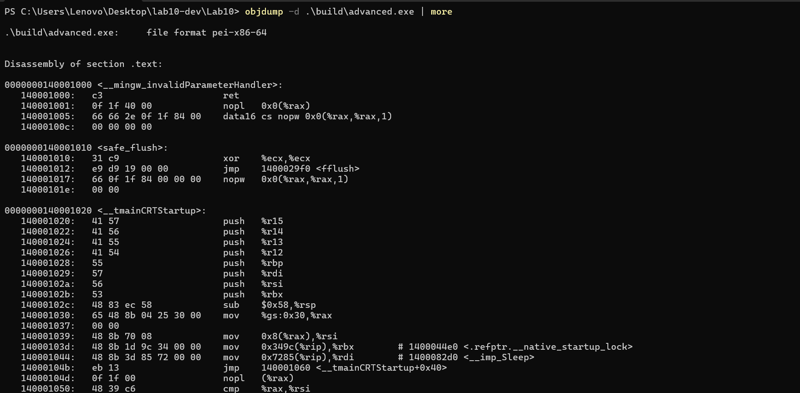

*Disassembly of `_Z3addii` — the inline `add %ebx, %eax` instruction inside the function:*

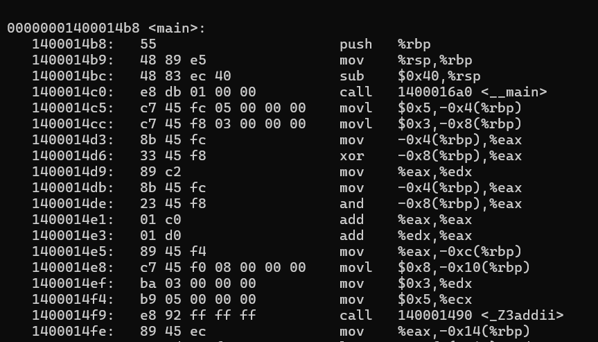

---

## 5. Reverse-engineering walkthrough (Ghidra)

Target binaries were built with `-O0` (no optimization) so the obfuscation patterns survive into the decompiled output:

```bash
g++ -O0 xor.cpp -o build/xor_re.exe
g++ -O0 project_cpp/main.cpp project_cpp/xor_obfuscation.cpp project_cpp/control_flow.cpp -o build/program_re.exe
```

### Run output

*Python demos (`main.py`, `obfuscation.py`) producing the expected encoded/decoded output:*

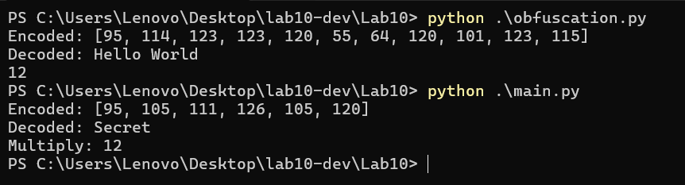

*C++ binaries (`xor.exe`, `controlflow.exe`, `project.exe`, `advanced.exe`) executed from `build/`:*

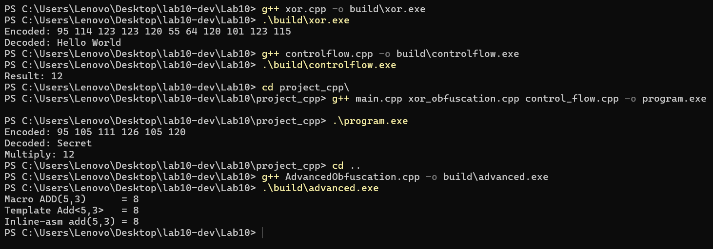

### Ghidra reverse-engineering steps

*Compiling the `-O0` reverse-engineering targets with g++:*

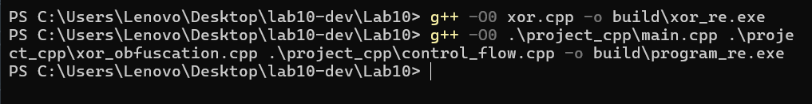

*Creating a new Ghidra non-shared project and importing `xor_re.exe`:*

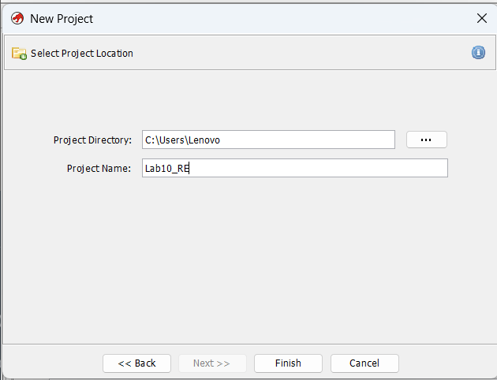

*Auto-analysis dialog — accepting default analyzers:*

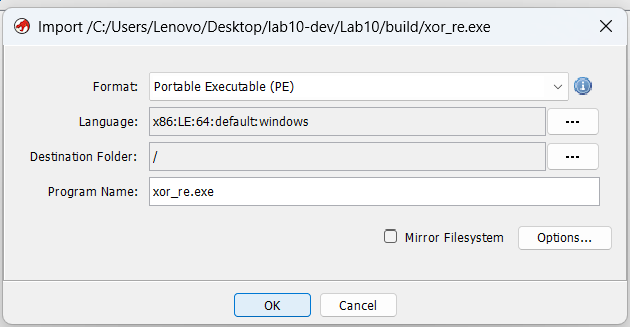

*Initial CodeBrowser view after analysis completes:*

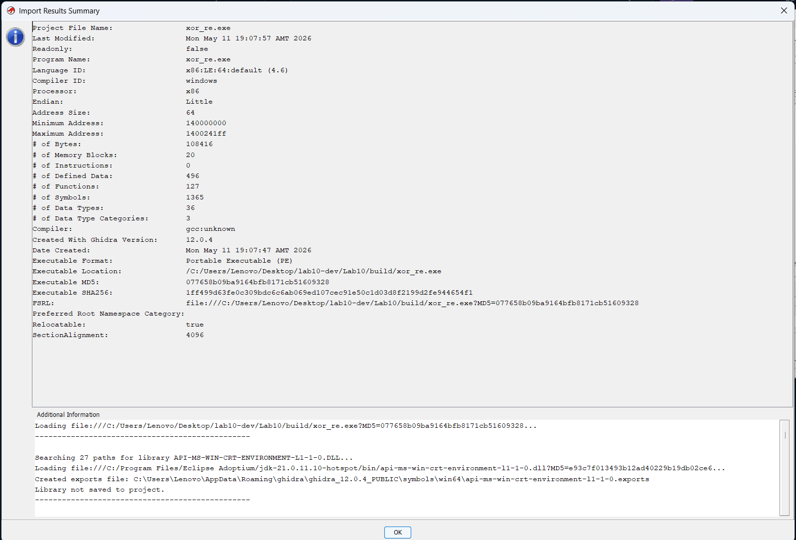

*Symbol Tree / Functions window with `main` and helpers visible:*

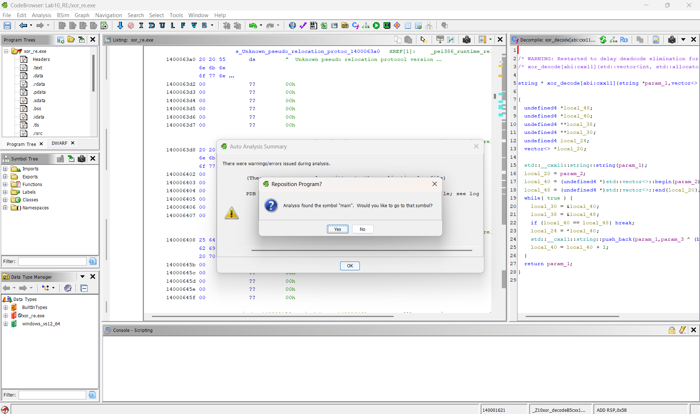

*Listing view of `main` — the XOR loop and key constant in disassembly:*

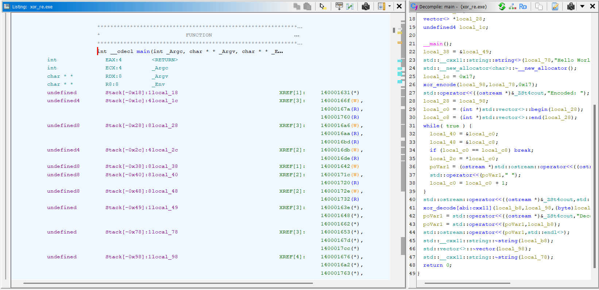

*Decompiler pseudo-C: the `^ 23` (0x17) XOR key recovered:*

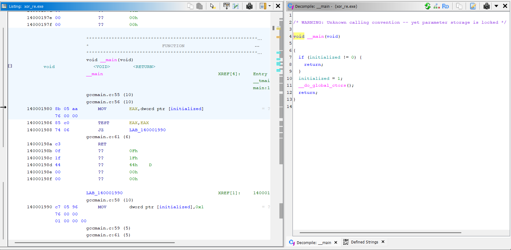

*`.rdata` section showing the **encoded** bytes — plaintext `"Hello World"` is **not** present, only the XOR-scrambled array:*

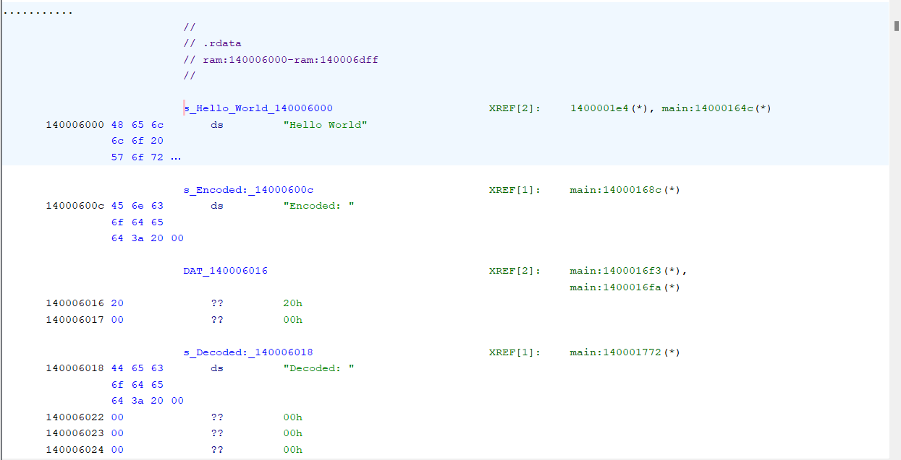

*Recovered plaintext after applying the XOR key to the bytes from `.rdata`:*

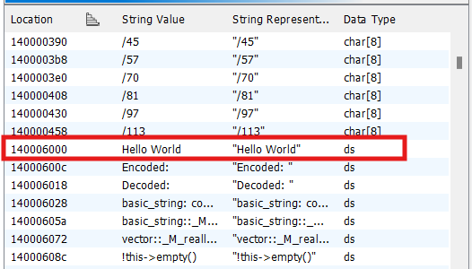

**Takeaway:** A `strings` scan of the binary never reveals `"Hello World"` — it only appears after the analyst spots the XOR loop, identifies the key, and applies it to the scrambled bytes. The same exercise on `program_re.exe` shows `hidden_multiply` as a state-machine loop in the decompiler rather than a plain `a * b`, increasing the cost of recovering the original intent.

---

## 6. Trade-offs

**Pros**
- Raises the cost of reverse engineering.
- Hides plaintext strings and simple arithmetic.

**Cons**
- Code becomes harder to maintain.
- Performance overhead from useless loops and indirect control flow.
- Determined attackers with a decompiler can still reconstruct logic — obfuscation delays, it does not prevent.
