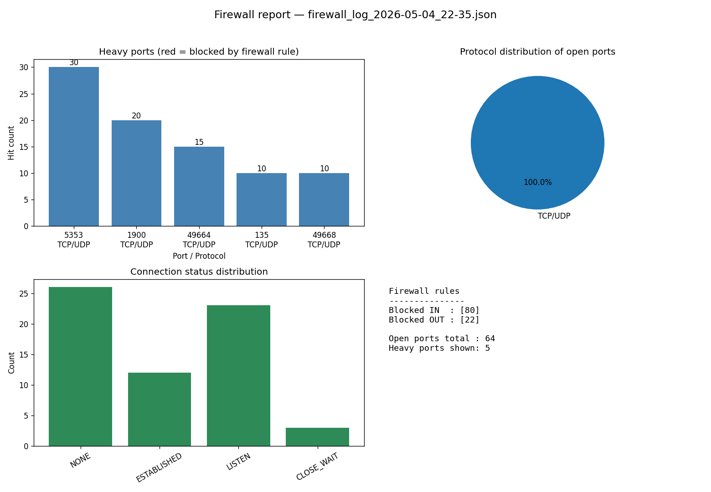

# Lab 13 — Simple Firewall System

Coursework implementation of **Laboratory Work 13: "Modeling a simple Firewall system"** (`Լաբ13.docx`). The project demonstrates the core ideas of a firewall — port enumeration, traffic monitoring, rule-based blocking, and logging — across three implementations (Python, C++/Linux, C++/Windows), plus one extension task: **logging + visualization**.

---

## 1. What a firewall does (lab background)

A firewall is a software or hardware system that controls network traffic according to security rules:

- monitors incoming traffic
- monitors outgoing traffic
- manages ports
- blocks dangerous connections

A **port** is a logical address used to distinguish services on a host. Traffic uses either:

- **TCP** — connection-oriented, reliable
- **UDP** — fast, unreliable

The lab's firewall has four core functions:

1. Port scanning (list active connections)
2. Port blocking (record blocked ports per direction)
3. Port unblocking
4. Traffic analysis (count usage, surface "heavy" ports)

---

## 2. Project layout

```
lab13-dev/
├── Լաբ13.docx                       # original lab assignment (Armenian)
└── Lab13/
    ├── README.md                    # this file
    ├── python/firewall1/
    │   ├── firewall-1.py            # base Python implementation
    │   ├── visualize.py             # extension: log visualizer (matplotlib)
    │   ├── firewall_log_*.json      # sample log outputs
    │   └── firewall_chart_*.png     # rendered chart outputs
    └── cpp/
        ├── linux/
        │   ├── lin-firewall1.cpp    # simulated firewall over /proc/net/tcp
        │   └── iptables.cpp         # real Linux firewall via iptables
        └── win-firewall1/           # Visual Studio solution
            ├── firewall1.sln
            ├── firewall1.vcxproj
            └── src/
                ├── main-firewall1.cpp        # simulated firewall via IP Helper API
                ├── firewall_win_api-cmd.cpp  # real Windows Firewall via PowerShell
                └── firewall_win_api-com.cpp  # real Windows Firewall via COM (INetFwPolicy2)
```

---

## 3. Python implementation (`Lab13/python/firewall1/firewall-1.py`)

Uses `psutil` to enumerate connections.

| Function | Purpose |
|---|---|
| `list_open_ports()` | Walks `psutil.net_connections()` and returns `{port, protocol, status}` for each active connection. Maps well-known ports (80/443/21/22/23) to `HTTP`/`HTTPS`/`FTP`/`SSH`/`Telnet`; everything else is `TCP/UDP`. |
| `block_port(port, direction)` | Adds the port to `firewall_rules["blocked_in"]` or `blocked_out`. In-memory only — does not touch the OS firewall. |
| `open_port(port)` | Removes the port from both blocked sets. |
| `monitor_traffic(duration)` | Polls `net_connections()` repeatedly and increments a counter per port. |
| `get_heavy_ports(top_n=5)` | Returns the top N most-seen ports from the counter. |
| `save_to_file(data)` | Dumps `{open_ports, heavy_ports, rules}` to `firewall_log_<YYYY-MM-DD_HH-MM>.json`. |

Run:

```powershell
cd Lab13\python\firewall1
pip install psutil
python firewall-1.py
```

This produces a new `firewall_log_*.json` in the same directory.

---

## 4. C++ implementations

### 4.1 Linux — simulated (`Lab13/cpp/linux/lin-firewall1.cpp`)

Mirrors the Python version but reads `/proc/net/tcp` directly. Local addresses are stored as `HEX_IP:HEX_PORT`; the port is extracted and converted via `stoi(hex, nullptr, 16)`. Blocking is in-memory only. Output goes to `firewall_log_<epoch>.txt`.

Compile and run:

```bash
g++ lin-firewall1.cpp -o firewall
./firewall
```

### 4.2 Linux — real (`Lab13/cpp/linux/iptables.cpp`)

Demonstrates **actual** packet blocking by shelling out to `iptables`:

```cpp
sudo iptables -A INPUT  -p tcp --dport <port> -j DROP   // block_port_in
sudo iptables -A OUTPUT -p tcp --dport <port> -j DROP   // block_port_out
sudo iptables -D INPUT  -p tcp --dport <port> -j DROP   // unblock (INPUT)
sudo iptables -D OUTPUT -p tcp --dport <port> -j DROP   // unblock (OUTPUT)
```

Requires `sudo`. To persist rules: `sudo iptables-save > /etc/iptables/rules.v4`.

### 4.3 Windows — simulated (`Lab13/cpp/win-firewall1/src/main-firewall1.cpp`)

Same logic as the Linux simulated version, but enumerates connections via the **IP Helper API** (`GetExtendedTcpTable` with `TCP_TABLE_OWNER_PID_ALL`). Logs to `firewall_log_<timestamp>.txt`.

Build either through the Visual Studio solution `firewall1.sln`, or with MinGW:

```bash
g++ main-firewall1.cpp -o firewall.exe -lws2_32 -liphlpapi
```

### 4.4 Windows — real

Two variants, both producing actual Windows Firewall rules:

- **`firewall_win_api-cmd.cpp`** — shells out to PowerShell:
  ```powershell
  New-NetFirewallRule -DisplayName "BlockPort" -Direction Inbound -LocalPort <port> -Protocol TCP -Action Block
  ```
  Must be run as **Administrator**.

- **`firewall_win_api-com.cpp`** — uses the COM interface `INetFwPolicy2` directly (no shell-out). Compile with:
  ```bash
  g++ firewall_win_api-com.cpp -lole32 -loleaut32
  ```
  Also requires Administrator privileges.

---

## 5. Extension: logging + visualization (`Lab13/python/firewall1/visualize.py`)

The lab document lists several optional extensions (GUI, scapy packet filtering, IDS behavior, etc.). This project implements **logging + visualization** — it reads the JSON logs already produced by `firewall-1.py` and renders a chart with `matplotlib`.

### What it draws

A single figure with four panels:

1. **Heavy ports** — bar chart of the top-N busiest ports. Bars colored **red** if the port appears in `blocked_in` or `blocked_out`, **blue** otherwise.
2. **Protocol distribution** — pie chart of `HTTP / HTTPS / FTP / SSH / Telnet / TCP-UDP` across all open ports.
3. **Connection status** — bar chart of `LISTEN / ESTABLISHED / TIME_WAIT / CLOSE_WAIT / NONE / ...` counts.
4. **Firewall rules summary** — text panel listing the blocked-IN and blocked-OUT sets, plus totals.

### How it picks the log

- With no argument: scans the script's directory for `firewall_log_*.json`, picks the **newest valid** file (broken/truncated logs are skipped).
- With an argument: loads exactly that file.

### Output

Saves the chart next to the log file as `firewall_chart_<same-timestamp>.png`. Example output:



### Run

```powershell
cd Lab13\python\firewall1
pip install matplotlib
python visualize.py                       # latest valid log
python visualize.py firewall_log_X.json   # specific log
```

---

## 6. Typical workflow

1. Run `firewall-1.py` — produces a `firewall_log_<timestamp>.json` snapshot of open ports, heavy ports, and the in-memory rule set.
2. Run `visualize.py` — produces `firewall_chart_<timestamp>.png` from that log.
3. (Optional) Run one of the C++ binaries on the matching OS to **actually** install rules into `iptables` or Windows Firewall.

---

## 7. Lab goals

By completing the lab the student should be able to:

- explain how network ports work
- distinguish TCP from UDP
- implement a simple firewall logic in code
- analyze network traffic at the application level
- apply the above on both Windows and Linux
