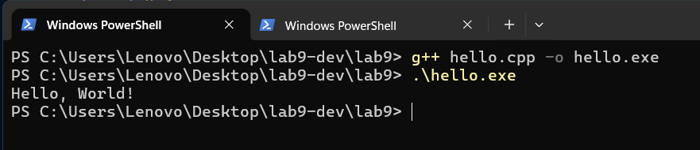
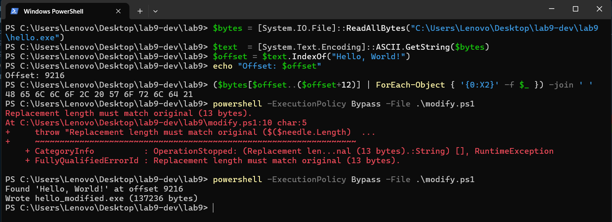
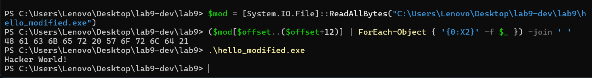

# Lab 9 — Binary Executable File Structure (Windows PE)

This lab explores the structure of a Windows PE (Portable Executable) binary by compiling a small C++ program, locating a string constant inside the binary, and patching that string directly in the `.exe` — without recompiling.

## Tools

- **Compiler:** MinGW-w64 `g++` (UCRT64, `C:\msys64\ucrt64\bin\g++.exe`)
- **OS:** Windows 11
- **Hex inspection / patching:** PowerShell

## Files

| File | Purpose |
|------|---------|
| `hello.cpp` | Source program |
| `hello.exe` | Original compiled binary |
| `hello_modified.exe` | Patched binary (`Hello, World!` → `Hacker World!`) |
| `modify.ps1` | PowerShell script that performs the byte patch |
| `screenshots/` | Step-by-step evidence |

---

## Step 1 — Source

`hello.cpp`:

```cpp
#include <iostream>

int main() {
    std::cout << "Hello, World!";
    return 0;
}
```

## Step 2 — Compile and run the original

```bash
g++ hello.cpp -o hello.exe
.\hello.exe
```

Output: `Hello, World!`



## Step 3 — Locate the string and verify the original bytes

The compiler stores string literals in the read-only data section (`.rdata`) of the PE file. We can find the byte offset of `"Hello, World!"` by scanning the binary, then dump the 13 bytes there to confirm. After that, `modify.ps1` overwrites those bytes with `Hacker World!` (also 13 bytes — same length is required so the file layout and all offsets stay valid) and writes `hello_modified.exe`.

```powershell
$bytes  = [System.IO.File]::ReadAllBytes("hello.exe")
$text   = [System.Text.Encoding]::ASCII.GetString($bytes)
$offset = $text.IndexOf("Hello, World!")
"Offset: $offset"
($bytes[$offset..($offset+12)] | ForEach-Object { '{0:X2}' -f $_ }) -join ' '
powershell -ExecutionPolicy Bypass -File .\modify.ps1
```

On this build the string lives at **offset 9216** with bytes:

```
48 65 6C 6C 6F 2C 20 57 6F 72 6C 64 21
 H  e  l  l  o  ,     W  o  r  l  d  !
```



## Step 4 — Verify the modified bytes and run the patched binary

```powershell
$mod = [System.IO.File]::ReadAllBytes("hello_modified.exe")
($mod[$offset..($offset+12)] | ForEach-Object { '{0:X2}' -f $_ }) -join ' '
.\hello_modified.exe
```

Modified bytes:

```
48 61 63 6B 65 72 20 57 6F 72 6C 64 21
 H  a  c  k  e  r     W  o  r  l  d  !
```

Output of the patched binary: `Hacker World!`

The program runs normally; only the string constant in `.rdata` was changed, not the executable code in `.text`.



---

## PE format — what's actually inside `hello.exe`

A Windows PE file is divided into named sections. The ones relevant here:

| Section | Contents |
|---------|----------|
| `.text`  | Machine code (the compiled instructions of `main`) |
| `.data`  | Initialized read/write globals |
| `.bss`   | Uninitialized globals (zero-filled at load time) |
| `.rdata` | **Read-only** constants — string literals like `"Hello, World!"` live here |
| `.idata` | Import table (which DLL functions the program uses) |

The patch worked because:

1. `"Hello, World!"` is a constant string literal, so the compiler emitted it verbatim into `.rdata`.
2. `std::cout <<` just receives a pointer to that location at runtime — it does not validate the bytes.
3. We replaced the 13 bytes in place, so the pointer in `.text` is still valid and points at the new string.

## What `modify.ps1` does

```powershell
$src = "hello.exe"
$dst = "hello_modified.exe"
$needle = "Hello, World!"
$replacement = "Hacker World!"

if ($needle.Length -ne $replacement.Length) {
    throw "Replacement length must match original ($($needle.Length) bytes)."
}

$bytes = [System.IO.File]::ReadAllBytes($src)
$text  = [System.Text.Encoding]::ASCII.GetString($bytes)
$offset = $text.IndexOf($needle)

if ($offset -lt 0) { throw "String '$needle' not found in $src." }

$newBytes = [System.Text.Encoding]::ASCII.GetBytes($replacement)
for ($i = 0; $i -lt $newBytes.Length; $i++) {
    $bytes[$offset + $i] = $newBytes[$i]
}

[System.IO.File]::WriteAllBytes($dst, $bytes)
```

Step by step:

1. **Defines** the input file, the output file, the string to find, and its replacement.
2. **Length guard.** Refuses to run unless both strings are the same byte length. A longer replacement would shift every byte after the patch and break pointers throughout the executable.
3. **Reads** the entire `hello.exe` into a byte array.
4. **Decodes** those bytes as ASCII text purely so `.IndexOf()` can find the pattern's byte offset.
5. **Bails out** if the string isn't present.
6. **Overwrites** the 13 bytes at the located offset with the ASCII bytes of the replacement string, in place.
7. **Writes** the modified byte array to `hello_modified.exe`. The original `hello.exe` is untouched.

## Limitations

- **Length must match.** A longer replacement would shift everything after it, breaking pointers throughout the file. The same-length constraint is the easy escape hatch; otherwise you would also have to fix up offsets and possibly relocate the section.
- Strings that are encrypted, obfuscated, or built at runtime won't be patchable this way.
- This technique modifies *data*, not *logic* — you can't change what the program does, only what it prints.

## Reproduce

```powershell
g++ hello.cpp -o hello.exe
powershell -ExecutionPolicy Bypass -File .\modify.ps1
.\hello_modified.exe   # prints: Hacker World!
```
